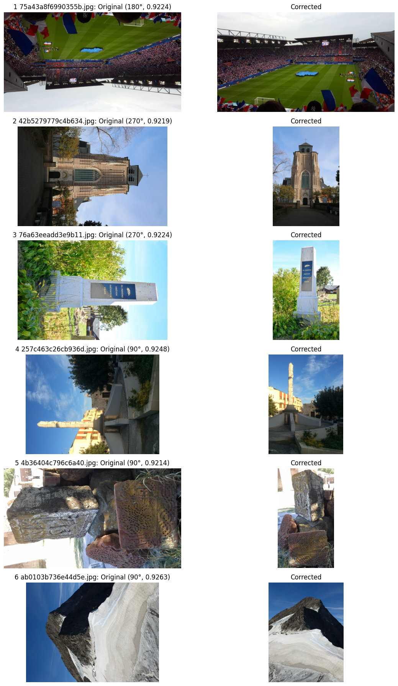
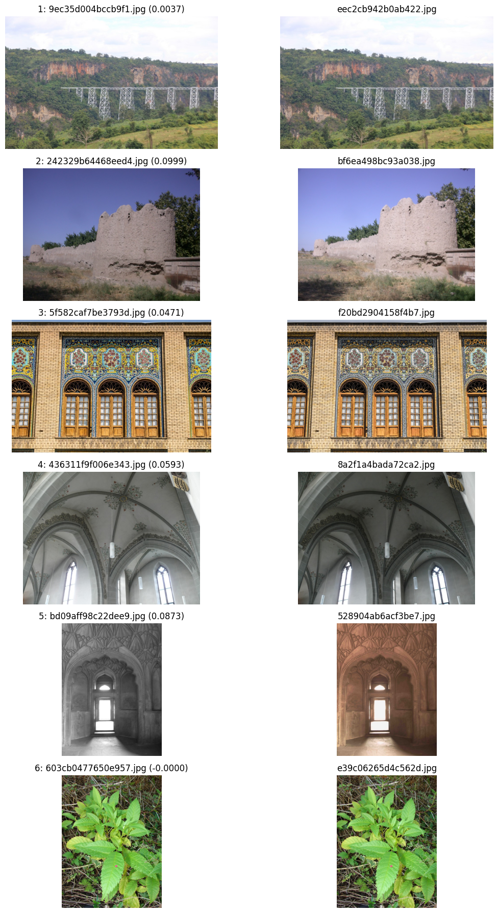

# VDC Real-World Workflow: Preparing the Google Landmarks Dataset v2

This document provides a detailed walkthrough of using the Vision Data Curation (VDC) framework to clean, deduplicate, and sample a large-scale image dataset - the Google Landmarks Dataset v2 (GLDv2).

We will build an SSL-purposed dataset, sampled to a target size of approximately 2 million images after initial validation, rotation correction, and aggressive deduplication.
Our goal is to create a diverse and clean subset suitable for self-supervised learning, where even near-duplicate images are undesirable to maximize data efficiency and model generalization.

Initial dataset size: 4,132,914 images.

## Prerequisites

Before starting, ensure you have:

1. **VDC Installed:** Follow the instructions in the `README.md` to install `vision-data-curation` from PyPI or source.

    ```sh
    pip install vision-data-curation
    ```

1. **Dataset Downloaded:** The Google Landmarks Dataset v2 should be downloaded and accessible on your file system. For this walkthrough, we assume the dataset root is `~/Datasets/GLDv2`.
1. **GPU Access:** Many steps, especially model inference, benefit significantly from GPU acceleration.
1. **Config File:** Ensure you are using the default config file without any overrides.

## The Curation Pipeline Applied to Google Landmarks Dataset v2

### Step 1: Dataset Acquisition (Assumed)

For this walkthrough, we assume the Google Landmarks Dataset v2 has already been downloaded and is available at `~/Datasets/GLDv2`. Please refer to the [official documentation](https://github.com/cvdfoundation/google-landmark) for instructions on acquiring this dataset.

### Step 2: Sanitize Images (Input Validation)

The `sanitize_images` script detects and fixes issues like corrupt files, invalid formats, low resolution or extreme aspect ratios.
In this step, we apply fixes directly, backing up any deleted files.
For GLDv2, a common issue is very narrow panoramic images that might not be ideal for general-purpose vision tasks.
Our default `min_aspect_ratio` and `max_aspect_ratio` settings will remove these.

```sh
python -m vdc.scripts.sanitize_images --project gldv2 --apply-fixes --backup-dir data/backup/gldv2/sanitize ~/Datasets/GLDv2
```

A total of 6,220 images were removed.

### Step 3: Rotation Correction

This step automatically detects and corrects images that are unintentionally rotated by 90°, 180°, or 270°. We first generate rotation predictions using a specialized model and then apply the corrections with a high confidence threshold.

1. **Download Rotation Prediction Model:**
    We will use `rope_vit_reg8_so150m_p14_swiglu_rms_ap_rotnet-capi` model to predict the correct orientation of images.

    ```sh
    python -m birder.tools download-model rope_vit_reg8_so150m_p14_swiglu_rms_ap_rotnet-capi
    ```

1. **Generate Rotation Predictions:**
    Predict rotation probabilities for all images in the dataset.

    ```sh
    python -m birder.scripts.predict -n rope_vit_reg8_so150m_p14_swiglu_rms_ap -t rotnet-capi --gpu --parallel --batch-size 256 --chunk-size 50000 --compile --fast-matmul --save-output --output-format parquet --prefix gldv2 ~/Datasets/GLDv2
    ```

1. **Apply Rotation Correction:**
    Apply the detected rotations to the images. We use a high threshold of `0.9` to ensure that only confidently predicted rotations are applied. Original files are backed up.

    ```sh
    python -m vdc.scripts.rotation_correction --project gldv2 --threshold 0.9 --apply-rotation --backup-dir data/backup/gldv2/rotation results/gldv2_rope_vit_reg8_so150m_p14_swiglu_rms_ap_rotnet-capi_4_252px_crop1.0_4126694_output.parquet
    ```

    104,302 images were corrected for orientation issues.

    <details>
    <summary>Click to view Rotation Correction Example</summary>

    

    *Figure 1: Example of an image from GLDv2 before (left) and after (right) rotation correction, showcasing how VDC automatically fixes common orientation errors.*
    </details>

### Step 4: Deduplication

This step identifies and removes near-duplicate images from the dataset.
For an SSL-purposed dataset, an aggressive deduplication strategy is often beneficial to prevent redundant information and encourage the model to learn from a wider variety of distinct examples.

1. **Download SSCD Model:**
    For a Self-Supervised Descriptor for Image Copy Detection ([SSCD](https://arxiv.org/abs/2202.10261)) embeddings, we use the `resnet_v1_50_c1_sscd` model.

    ```sh
    python -m birder.tools download-model resnet_v1_50_c1_sscd
    ```

1. **Generate SSCD Embeddings:**
    Predict SSCD logits for all images. These logits are used as embeddings for deduplication.

    ```sh
    python -m birder.scripts.predict -n resnet_v1_50_c1 -t sscd --gpu --parallel --batch-size 256 --chunk-size 50000 --compile --fast-matmul --save-logits --output-format parquet --prefix gldv2 ~/Datasets/GLDv2
    ```

1. **Build LSH Index:**
    A Locality Sensitive Hashing (LSH) index is built from the embeddings to efficiently find similar images. This step includes centering and L2 normalization as recommended by the SSCD authors <https://github.com/facebookresearch/sscd-copy-detection#using-sscd-descriptors>.

    ```sh
    python -m vdc.scripts.build_lsh_index --project gldv2 --center-embeddings --l2-normalize results/gldv2_resnet_v1_50_c1_sscd_512_320px_crop1.0_4126694_logits.parquet
    ```

1. **Identify Duplicates and Report:**
    This command generates a report on duplicate groups based on a specified distance metric and threshold.
    We use an aggressive `report-threshold` of `0.5` for cosine distance. This value is higher than typical for exact copy detection but should be suitable here.

    ```sh
    python -m vdc.scripts.deduplicate_images --project gldv2 --report-threshold 0.5 --distance-metric cosine --lsh-index results/gldv2/lsh_index.pkl results/gldv2_resnet_v1_50_c1_sscd_512_320px_crop1.0_4126694_logits.parquet
    ```

    The initial report identifies a number of potential duplicate groups. Inspecting these groups is crucial for fine-tuning.

    <details>
    <summary>Click to view Deduplication Examples</summary>

    

    *Figure 2: Examples of near-duplicate image groups detected by VDC from the GLDv2 dataset, illustrating the kind of visually similar content that will be deduplicated.*
    </details>

1. **Apply Deduplication (Deletion):**
    After selecting an appropriate threshold (e.g., 0.25 based on analysis), images identified as duplicates are deleted with backup.

    ```sh
    python -m vdc.scripts.apply_deduplication --project gldv2 --threshold 0.25 --apply-deletion --backup-dir data/backup/gldv2/dedup
    ```

    18,412 files were deleted.

### Step 5: Hierarchical K-Means Sampling

Finally, to create a diverse and representative subset of our now cleaned and deduplicated dataset, hierarchical K-Means clustering is used for sampling. We aim for a final dataset size of 2,000,000 images.

For this step, we'll use the [Perception Encoder](https://arxiv.org/abs/2504.13181) model, which is a good general-purpose vision encoder for clustering.

1. **Download PE Model:**
    We'll download the *Base/16* variant.

    ```sh
    python -m birder.tools download-model rope_i_vit_b16_pn_aps_c1_pe-core
    ```

1. **Generate Embeddings for Main Dataset:**
    Generate embeddings for the entire dataset using the model. These will be used for clustering.

    ```sh
    python -m birder.scripts.predict -n rope_i_vit_b16_pn_aps_c1 -t pe-core --gpu --parallel --compile --amp --amp-dtype bfloat16 --batch-size 256 --chunk-size 50000 --save-embeddings --output-format parquet --prefix gldv2 ~/Datasets/GLDv2
    ```

1. **Convert Embeddings to NPY (for Memory-Mapping):**
    For efficient memory-mapped access during clustering, the parquet embeddings are converted to NPY format and L2-normalized.

    ```sh
    python -m vdc.scripts.convert_to_npy --chunk-size 50000 --l2-normalize results/gldv2_rope_i_vit_b16_pn_aps_c1_pe-core_0_224px_crop1.0_4108282_embeddings.parquet
    ```

1. **Perform Hierarchical K-Means Clustering:**
    A hierarchical clustering approach is used to select a diverse subset. The `--n-clusters` parameter defines the number of clusters at each level of the hierarchy.

    ```sh
    python -m vdc.scripts.hierarchical_kmeans_clustering --project gldv2 --preload-to-device --fast-matmul --n-clusters 45000 900 90 --chunk-size 200000 --method resampled --n-samples 10 5 3 --n-resamples 10 --x-pre-normalized --cache-dir data/gldv2/cache results/gldv2_rope_i_vit_b16_pn_aps_c1_pe-core_0_224px_crop1.0_4108282_embeddings.parquet
    ```

1. **Sample according to Budget:**
    Explore the clustering results using the example notebook at [notebooks/explore_clustering.Rmd](../../notebooks/explore_clustering.Rmd).

    ```sh
    python -m vdc.scripts.sample_images --project gldv2 --total-samples 2_000_000
    ```

    To actually perform the sampling, add `--apply-deletion`.

    If you’ve reviewed the sampled list and are satisfied, you can re-run with:

    ```sh
    python -m vdc.scripts.sample_images --project gldv2 --use-existing-sampled-list --apply-deletion
    ```

    After all filtering and sampling steps, the dataset now contains exactly 2,000,000 diverse images, precisely achieving our target for the SSL-purposed dataset.

## Conclusion

This walkthrough demonstrates the effective application of the Vision Data Curation (VDC) framework to transform the raw Google Landmarks Dataset v2 into a clean, aggressively deduplicated and diverse subset tailored for self-supervised learning.
By systematically performing input validation, rotation correction, deduplication and hierarchical sampling, we have created a high-quality dataset of a precise size, ready for training robust vision models.
The modular nature of VDC allowed us to streamline the pipeline, focusing only on the necessary steps to meet the specific requirements of an SSL dataset.
