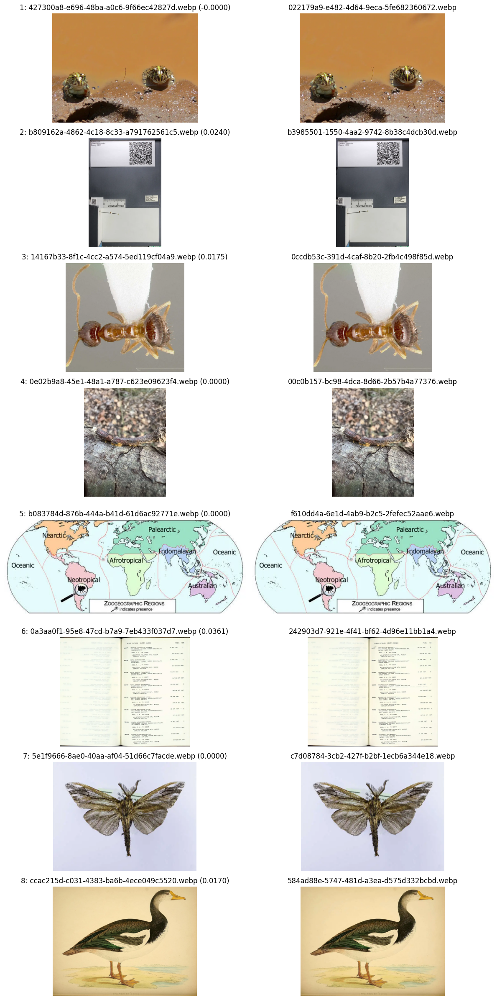
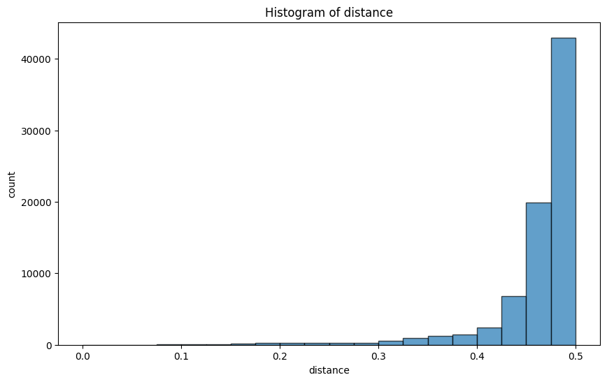
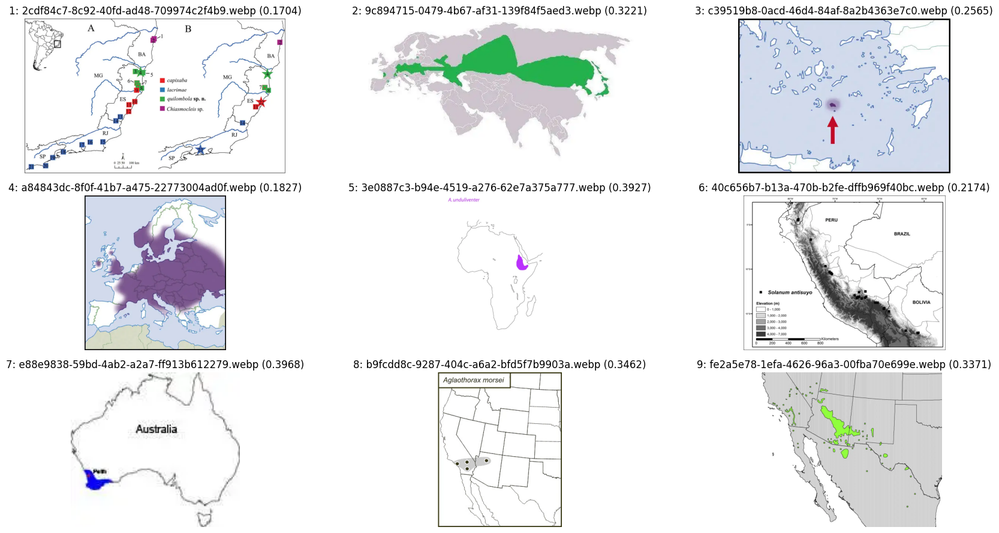
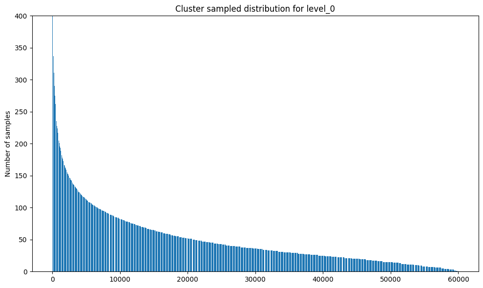
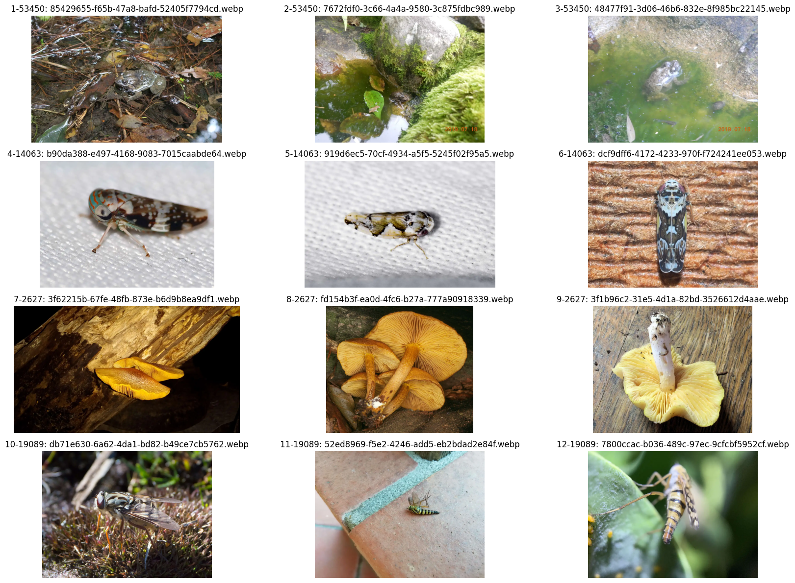

# VDC Real-World Workflow: Cleaning the Tree of Life 10M Dataset

This document provides a detailed walkthrough of using the Vision Data Curation (VDC) framework to clean, filter and sample a large-scale image dataset - the Tree of Life 10M (EOL) dataset.

We will build an SSL-purposed dataset, sampled to 3M images after filtering non-natural images (removing documents, etc.).
We will only work on the training split of the Encyclopedia of Life (EOL) part of the Tree of Life dataset.

## Prerequisites

Before starting, ensure you have:

1. **VDC Installed:** Follow the instructions in the `README.md` to install `vision-data-curation` from PyPI or source.

    ```sh
    pip install vision-data-curation
    ```

1. **Dataset Downloaded:** The Tree of Life 10M dataset should be downloaded and accessible on your file system. For this walkthrough, we assume the dataset root is `~/Datasets/TreeOfLife-10M`.
1. **GPU Access:** Many steps, especially model inference, benefit significantly from GPU acceleration.
1. **Config File:** Ensure you are using the default config file without any overrides.

## The Curation Pipeline Applied to Tree of Life 10M

We will follow a pipeline similar to the one outlined in the VDC `README.md` (besides the rotation correction), applying each step sequentially.
The process involves initial conversion, validation, deduplication, multiple stages of example-based filtering, aesthetic filtering, and finally, hierarchical sampling.

### Step 1: Dataset Acquisition and Preparation

This initial step focuses on acquiring the Tree of Life 10M dataset.

To standardize the image format, optimize storage and processing, and prevent issues during subsequent `sanitize_images` phases, all images will be converted to WebP.
Additionally, any excessively large images will be resized to cap their pixel count, preserving sufficient detail while preventing prohibitively large files.

#### Option 1: Download the Original Dataset and Manually Convert (Advanced)

This path involves downloading the original Tree of Life 10M dataset (in JPEG format). This option offers maximum control but requires a more technical setup and understanding.

1. **Download the Original Dataset:**
    First, download the full Tree of Life 10M dataset to your desired location (e.g., `~/Datasets/TreeOfLife-10M-orig`). Use the provided `download_tol10m.sh` script for this:

    ```sh
    # The script will download the dataset to the CWD
    ./download_tol10m.sh
    ```

2. **Manually Convert to WebP Format:**
    After downloading, convert all images to WebP format, resizing them to ensure a maximum pixel count (e.g., 1,048,576 pixels total, equivalent to 1024x1024 without enforcing square aspect ratio). This prevents excessively large images while preserving sufficient detail.

    **Note:** This command requires `mogrify` (ImageMagick) to be installed and available in your PATH. It's a powerful but complex command, and careful attention to the output path is crucial to avoid unintended directory structures.

    ```sh
    find TreeOfLife-10M-orig/ -type f -name '*.jpg' -print0 | parallel -0 'mkdir -p "TreeOfLife-10M/$(dirname {})" && mogrify -format webp -resize "1048576@>" -path "TreeOfLife-10M/$(dirname {})" {}' \;
    ```

#### Option 2: Download the Pre-converted Dataset (Recommended)

For simplicity and to avoid manual conversion complexities, we **strongly recommend** directly downloading the pre-converted WebP version of the dataset from Hugging Face.
This dataset is already in the optimized format with images resized appropriately, ready for the VDC pipeline.

Download the dataset from the following link to your desired location (e.g., `~/Datasets/TreeOfLife-10M`):

<https://huggingface.co/datasets/birder-project/TreeOfLife-10M-WEBP>

You can use `git clone` with `git lfs` for large files or download it via the Hugging Face CLI or UI.

```sh
hf download birder-project/TreeOfLife-10M-WEBP --repo-type dataset
```

### Step 2: Sanitize Images (Input Validation)

The `sanitize_images` script detects and fixes issues like corrupt files, invalid formats, or low resolution. In this step, we apply fixes directly, backing up any deleted files.

```sh
python -m vdc.scripts.sanitize_images --project tol10m --apply-fixes --backup-dir data/backup/tol10m/sanitize ~/Datasets/TreeOfLife-10M
```

846 corrupt or invalid images were deleted from the dataset. Since a mass re-encode was performed in the previous step, `sanitize_images` did not need to perform additional re-encoding or resizing.

### Step 3: Deduplication

This step identifies and removes near-duplicate images.
It involves generating embeddings, building an LSH index, and then applying a threshold-based deduplication.

1. **Download SSCD Model:**
    For a Self-Supervised Descriptor for Image Copy Detection ([SSCD](https://arxiv.org/abs/2202.10261)) embeddings, we use the `resnet_v1_50_c1_sscd` model.

    ```sh
    python -m birder.tools download-model resnet_v1_50_c1_sscd
    # Alternative: python -m birder.tools download-model sscd_resnext_101_c1 --format pts
    ```

1. **Generate SSCD Embeddings:**
    Predict SSCD logits for all images. These logits are used as embeddings for deduplication.

    ```sh
    python -m birder.scripts.predict -n resnet_v1_50_c1 -t sscd --gpu --parallel --batch-size 256 --chunk-size 50000 --compile --fast-matmul --save-logits --output-format parquet --prefix tol10m ~/Datasets/TreeOfLife-10M
    # Alternative for sscd_resnext_101_c1: python -m birder.scripts.predict -n sscd_resnext_101_c1 --pts --gpu --parallel --batch-size 256 --chunk-size 50000 --fast-matmul --save-logits --output-format parquet --prefix tol10m ~/Datasets/TreeOfLife-10M
    ```

1. **Build LSH Index:**
    A Locality Sensitive Hashing (LSH) index is built from the embeddings to efficiently find similar images. This step includes centering and L2 normalization as recommended by the SSCD authors <https://github.com/facebookresearch/sscd-copy-detection#using-sscd-descriptors>.

    ```sh
    python -m vdc.scripts.build_lsh_index --project tol10m --center-embeddings --l2-normalize results/tol10m_resnet_v1_50_c1_sscd_512_320px_crop1.0_5907929_logits.parquet
    ```

1. **Identify Duplicates and Report:**
    This command generates a report on duplicate groups based on a specified distance metric and threshold.

    ```sh
    python -m vdc.scripts.deduplicate_images --project tol10m --report-threshold 0.25 --distance-metric cosine --lsh-index results/tol10m/lsh_index.pkl results/tol10m_resnet_v1_50_c1_sscd_512_320px_crop1.0_5907929_logits.parquet
    ```

    For fine-tuning the threshold, it's often useful to inspect groups in a dedicated notebook ([notebooks/explore_dedup.Rmd](notebooks/explore_dedup.Rmd)).
    This notebook allows you to visualize embedding distributions, review representative images from clusters, and assess the impact of different thresholds before applying deletion.

    The initial report showed 1,048,553 potential duplicate groups among 5,907,929 samples. Way bigger than usual, probably because Biology at large is more of a "fine grained classification". We'll have to explore and select a very conservative threshold.

    <details>
    <summary>Click to view Deduplication Examples</summary>

    

    *Figure 1: Examples of near-duplicate image groups detected by VDC, illustrating the kind of content that will be deduplicated.*
    </details>

1. **Apply Deduplication (Deletion):**
    After selecting an appropriate threshold (e.g., 0.04 based on analysis), images identified as duplicates are deleted with backup.

    ```sh
    python -m vdc.scripts.apply_deduplication --project tol10m --threshold 0.04 --apply-deletion --backup-dir data/backup/tol10m/dedup
    ```

    128,435 files were deleted.

### Step 4: Filter by Example (Removing Unwanted Content)

This step removes images that are visually similar to a set of user-provided "unwanted examples".
Here, we would like to keep only natural imagery, so we will remove notebooks, maps and other such images.

A quick manual look at the first shard, we can easily find examples from various groups we want to filter.

1. **Download PE Model:**
    The [Perception Encoder](https://arxiv.org/abs/2504.13181) model family are great general purpose vision encoders.

    ```sh
    python -m birder.tools download-model rope_i_vit_l14_pn_aps_c1_pe-core
    ```

1. **Generate Embeddings for Main Dataset:**
    Generate embeddings for the entire dataset using the model. These will be used for comparison with example embeddings.

    ```sh
    python -m birder.scripts.predict -n rope_i_vit_l14_pn_aps_c1 -t pe-core --gpu --parallel --compile --amp --amp-dtype bfloat16 --batch-size 256 --chunk-size 50000 --save-embeddings --output-format parquet --prefix tol10m ~/Datasets/TreeOfLife-10M
    ```

1. **Generate Embeddings for Unwanted Example Groups:**
    Each category of unwanted images (e.g., maps, charts, drawings, etc.) is processed separately to allow for different filtering thresholds.
    You will need to prepare your own set of unwanted example images.
    For this walkthrough, we assume these examples are stored under `/mnt/local/Datasets/TreeOfLife-10M/unwanted_examples/`.

    - **Maps:**

        ```sh
        python -m birder.scripts.predict -n rope_i_vit_l14_pn_aps_c1 -t pe-core --gpu --parallel --amp --amp-dtype bfloat16 --batch-size 256 --chunk-size 50000 --save-embeddings --output-format parquet --prefix tol10m-maps /mnt/local/Datasets/TreeOfLife-10M/unwanted_examples/maps
        ```

        ```sh
        python -m vdc.scripts.filter_by_examples --project tol10m --output-csv results/tol10m/filter_by_examples_maps_report.csv --examples-embeddings-file results/tol10m-maps_rope_i_vit_l14_pn_aps_c1_pe-core_0_336px_crop1.0_3_embeddings.parquet --report-threshold 0.3 results/tol10m_rope_i_vit_l14_pn_aps_c1_pe-core_0_336px_crop1.0_5779494_embeddings.parquet
        ```

        Explore the outputs using the example notebook at [notebooks/explore_scores.Rmd](../../notebooks/explore_scores.Rmd).
        This notebook helps visualize score distributions, identify appropriate thresholds and sample images around the threshold to evaluate filtering effectiveness.

        <details>
        <summary>Click to view Maps Filter Distance Histogram</summary>

        

        *Figure 2: Distribution of similarity (distance) scores for images against "map" examples. Images with lower scores (more similar) are candidates for removal.*
        </details>

        <details>
        <summary>Click to view Maps Filter Examples</summary>

        

        *Figure 3: Examples of images identified as similar to "map" examples. This visual inspection aids in fine-tuning the `0.4` threshold for effective removal.*

        </details>

        A threshold of `0.4` was chosen for maps, balancing removal of maps with minimal impact on natural images.

        ```sh
        python -m vdc.scripts.apply_score_filter --project tol10m --apply-deletion --backup-dir data/backup/tol10m/unwanted_samples --report-csv results/tol10m/filter_by_examples_maps_report.csv --score-column distance --threshold 0.4 --output-csv results/tol10m/score_filter_actions_maps_report.csv
        ```

    - **Repeat for other categories:**
        - **Charts:** Chosen threshold `0.2`.
        - **Drawings:** Chosen threshold `0.11` (this category was quite noisy, requiring a conservative threshold).
        - **Footprint:** While natural images, they were not exactly what was desired, so a threshold of `0.34` was applied for removal.
        - **Misc:** Chosen threshold `0.1`.
        - **Notebook pages:** A very clear-cut category, threshold `0.2`.
        - **Specimen photography:** Noisy category, `0.28` offered a good balance.

    *Perform the `predict`, `filter_by_examples`, and `apply_score_filter` steps for each of these example groups, adjusting the `--prefix` and `--examples-embeddings-file` accordingly.*

### Step 5: Aesthetic Filter

Although the Tree of Life dataset is a very high-quality dataset, we can inspect and remove images with very low aesthetic scores to further refine the dataset (mostly blurred out of focus images).

1. **Download CLIP Model:**
    The OpenAI CLIP model (ViT-L/14) is used to generate logits which are then processed into an aesthetic score.

    ```sh
    python -m birder.tools download-model vit_l14_pn_quick_gelu_openai-clip
    ```

1. **Generate CLIP Logits:**

    ```sh
    python -m birder.scripts.predict -n vit_l14_pn_quick_gelu -t openai-clip --gpu --parallel --compile --amp --amp-dtype bfloat16 --batch-size 256 --chunk-size 50000 --save-logits --output-format parquet --prefix tol10m ~/Datasets/TreeOfLife-10M
    ```

1. **Calculate Aesthetic Scores and Report:**

    ```sh
    python -m vdc.scripts.aesthetic_filter --project tol10m results/tol10m_vit_l14_pn_quick_gelu_openai-clip_768_224px_crop1.0_5704723_logits.parquet
    ```

    The same *score* notebook fits here as well [notebooks/explore_scores.Rmd](../../notebooks/explore_scores.Rmd).

1. **Apply Aesthetic Score Filter (Deletion):**
    A threshold of `3.4` was selected.

    ```sh
    python -m vdc.scripts.apply_score_filter --project tol10m --apply-deletion --backup-dir data/backup/tol10m/aesthetic --report-csv results/tol10m/aesthetic_filter_report.csv --score-column aesthetic_score --threshold 3.4 --output-csv results/tol10m/aesthetic_score_filter_actions_report.csv
    ```

### Step 6: Extra Step - Refined Filter By Example

Started from 5,908,775 we're now down to 5,698,042 with very conservative filtering.

At the previous step, we saw quite a lot of drawings left. Let's try and filter some more.

1. **Generate Embeddings for "Extra" Unwanted Examples:**

    You can also reuse previous embeddings, just prune removed images using the `prune_missing_samples` script.

    ```sh
    python -m birder.scripts.predict -n rope_i_vit_l14_pn_aps_c1 -t pe-core --gpu --parallel --amp --amp-dtype bfloat16 --batch-size 256 --chunk-size 50000 --save-embeddings --output-format parquet --prefix tol10m-extra /mnt/local/Datasets/TreeOfLife-10M/unwanted_examples/extra
    ```

1. **Filter and Report with "Extra" Examples:**

    ```sh
    python -m vdc.scripts.filter_by_examples --project tol10m --output-csv results/tol10m/filter_by_examples_extra_report.csv --examples-embeddings-file results/tol10m-extra_rope_i_vit_l14_pn_aps_c1_pe-core_0_336px_crop1.0_134_embeddings.parquet --report-threshold 0.3 results/tol10m_rope_i_vit_l14_pn_aps_c1_pe-core_0_336px_crop1.0_5779494_embeddings.parquet
    ```

1. **Apply Filter (Deletion):**
    A threshold of `0.25` was applied for this extra filtering pass.

    ```sh
    python -m vdc.scripts.apply_score_filter --project tol10m --apply-deletion --backup-dir data/backup/tol10m/unwanted_samples --report-csv results/tol10m/filter_by_examples_extra_report.csv --score-column distance --threshold 0.25 --output-csv results/tol10m/score_filter_actions_extra_report.csv
    ```

    Starting from 5,908,775 images, the conservative filtering steps brought the dataset down to 5,607,951 images. This low amount of filtered images is a testament to the original dataset's quality.

### Step 7: Hierarchical K-Means Sampling

Finally, to create a diverse and representative subset of the large dataset, hierarchical K-Means clustering is used for sampling.
See "[Automatic Data Curation for Self-Supervised Learning: A Clustering-Based Approach](https://arxiv.org/abs/2405.15613)" to get a better understanding of the concept.

For this step, we can also use [BioCLIP-2](https://huggingface.co/birder-project/vit_l14_pn_bioclip-v2) as a domain specific model for sampling.

1. **Prune Embeddings for Removed Samples:**
    Before sampling, it's crucial to ensure that the embeddings used for clustering correspond *only* to the images that still remain in the dataset after all previous filtering steps.
    The `prune_missing_samples` script achieves this by comparing the existing image paths in the embedding file with the actual files on your filesystem, removing any embedding entries for images that have been deleted.

    ```sh
    python -m vdc.scripts.prune_missing_samples --output-file results/tol10m_rope_i_vit_l14_pn_aps_c1_pe-core_filtered_embeddings.parquet results/tol10m_rope_i_vit_l14_pn_aps_c1_pe-core_0_336px_crop1.0_5779494_embeddings.parquet
    ```

1. **Convert Embeddings to NPY (for Memory-Mapping):**
    For efficient memory-mapped access during clustering, the parquet embeddings are converted to NPY format and L2-normalized.

    ```sh
    python -m vdc.scripts.convert_to_npy --chunk-size 50000 --l2-normalize results/tol10m_rope_i_vit_l14_pn_aps_c1_pe-core_filtered_embeddings.parquet
    ```

1. **Perform Hierarchical K-Means Clustering:**
    A hierarchical clustering approach is used to select a diverse subset. The `--n-clusters` parameter defines the number of clusters at each level of the hierarchy.

    ```sh
    python -m vdc.scripts.hierarchical_kmeans_clustering --project tol10m --compile --fast-matmul --n-clusters 60000 1200 120 --chunk-size 30000 --method resampled --n-samples 10 5 3 --n-resamples 10 --x-pre-normalized --cache-dir data/tol10m/cache results/tol10m_rope_i_vit_l14_pn_aps_c1_pe-core_filtered_embeddings.parquet
    ```

    *Optionally, if GPU memory allows for loading all embeddings, use `--preload-to-device` for faster processing:*

    ```sh
    python -m vdc.scripts.hierarchical_kmeans_clustering --project tol10m --preload-to-device --compile --fast-matmul --n-clusters 60000 1200 120 --chunk-size 10000 --method resampled --n-samples 10 5 3 --n-resamples 10 --x-pre-normalized --cache-dir data/tol10m/cache results/tol10m_rope_i_vit_l14_pn_aps_c1_pe-core_filtered_embeddings.parquet
    ```

1. **Sample according to Budget:**
    Explore the clustering results using the example notebook at [notebooks/explore_clustering.Rmd](../../notebooks/explore_clustering.Rmd).

    <details>
    <summary>Click to view Samples per Cluster</summary>

    

    *Figure 4: Distribution of sampled images per cluster (based on 3M budget).*
    </details>

    <details>
    <summary>Click to view Cluster Image Examples</summary>

    

    *Figure 5: Visual examples from multiple clusters. Each row corresponds to one cluster.*
    </details>

    ```sh
    python -m vdc.scripts.sample_images --project tol10m --total-samples 3_000_000
    ```

    After all filtering and sampling steps, the dataset now contains exactly 3,000,000 diverse images, precisely achieving our target for the SSL-purposed dataset.

## Conclusion

This walkthrough demonstrates the comprehensive capabilities of the Vision Data Curation (VDC) framework in transforming a raw, large-scale dataset into a clean, high-quality and diverse subset.
By systematically applying input validation, deduplication, multiple rounds of example-based filtering, aesthetic filtering, and hierarchical sampling, we were able to significantly refine the Tree of Life 10M dataset with a structured and scalable approach.

The modular nature of VDC allows for a flexible pipeline, enabling researchers and practitioners to tailor their data curation process to specific project needs and iterate on filtering criteria for optimal results.
